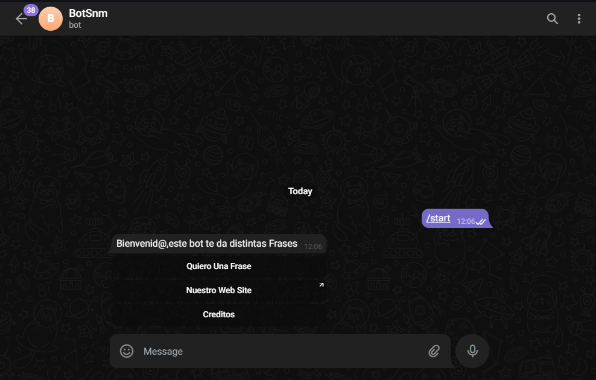
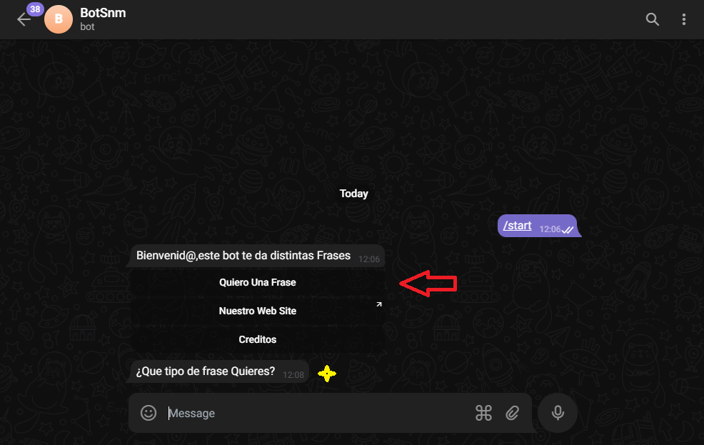
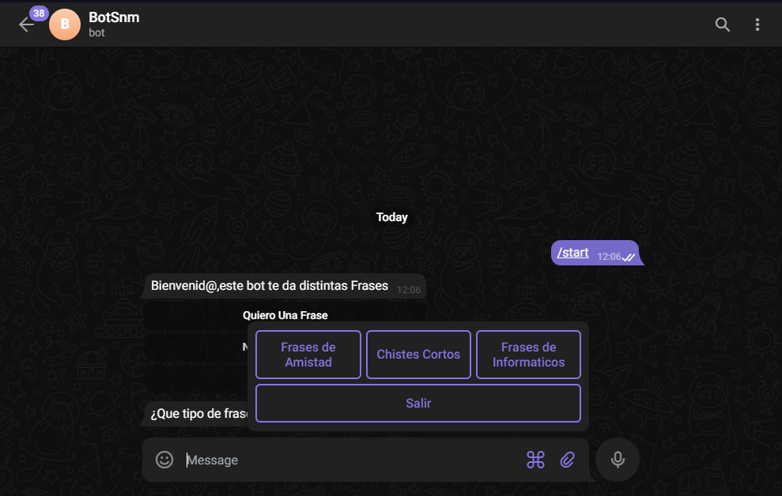
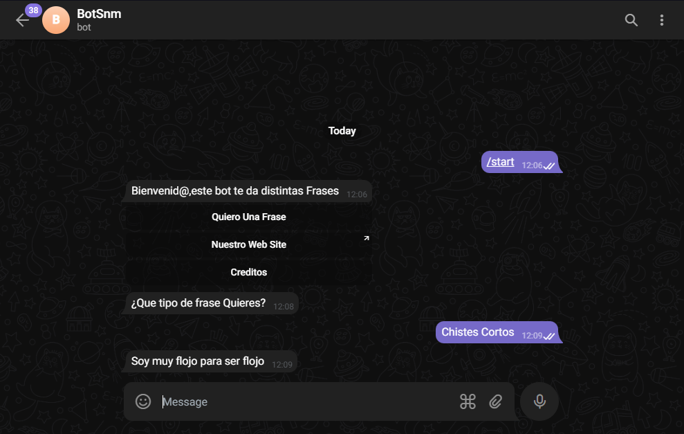
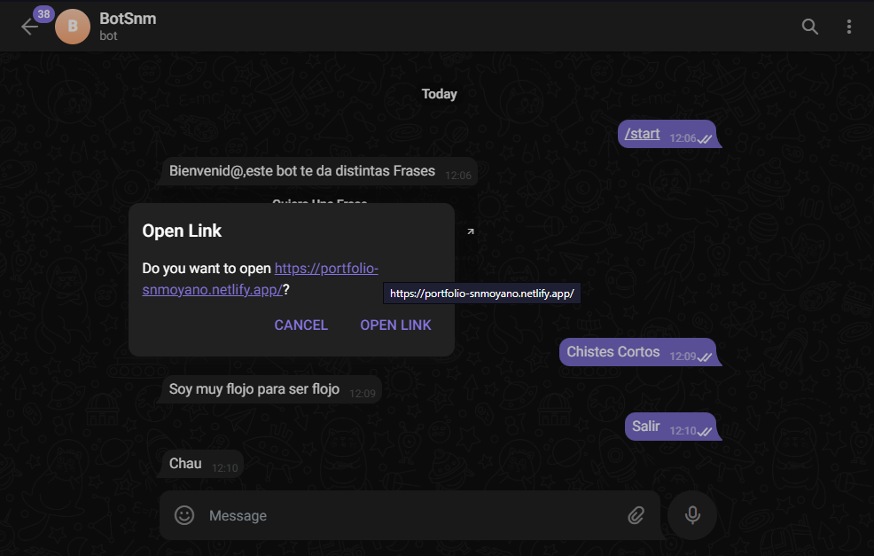

# Api Bot Telegram

## Bot telegram que a travez de un chat te responde frases de distintos generos : Informáticos , Graciosas y Amistad.

### Tecnoligias utlizadas :

 <ul>
    <li>Express</li>
    <li>Axios</li>
    <li>Dotenv</li>
    <li>Telegraf</li>
 </ul>

### Instalar Dependencias:

```javascript
npm install
```

### Poner en marcha Api:

```javascript
npm run dev
```

## Funcionabilidad :

### Iniciar Bot:

```javascript
/start
```


<p>Inicia bot y nos permite elegir entre:
    <ol>
    <li>Quiero una Frase</li>
    <li>Sitio  Web</li>
    <li>Creditos</li>
    </ol>
</p>

#### 1 - . Nos permite elegir que tipo de frase queres obtener ya sea : Informáticos , Graciosas y Amistad.

#### 1 - . a - Nos responde diciendonos ¿Que tipo de frase Quieres?





##### Nos arrojara una frase como la siguiente:

```javascript
'El amor es ciego; la amistad cierra sus ojos.'
```

#### 2 - . Nos dirige al sitio Web que predeterminemos.



```javascript
https://example.com
```

#### 3 - . Nos muestra los creditos que predeterminemos.

```javascript
"Creado" :"Snmoyano"
```

# Api Quotes

## Api creada para poder ser consumida por el bot creado anteriormente permitiendo elegir entre distinto tipos de frase obtner una frase random.

### Al solicitar una frase el bot mediante una peticion del tipo GET obtiene la frase.

#### Como en el ejemplo anterior no arroja la siguiente frase o la que allamos solicitado mediante el bot.

### Instalar Dependencias:

```javascript
npm install
```

### Poner en marcha Api:

```javascript
npm run dev
```

### Nos Arroja la frase para ser mostrada mediante el Bot como por ejemplo la siguiente:

```javascript
'El amor es ciego; la amistad cierra sus ojos.'
```

#### - El bot fue creado por Snmoyano. -
